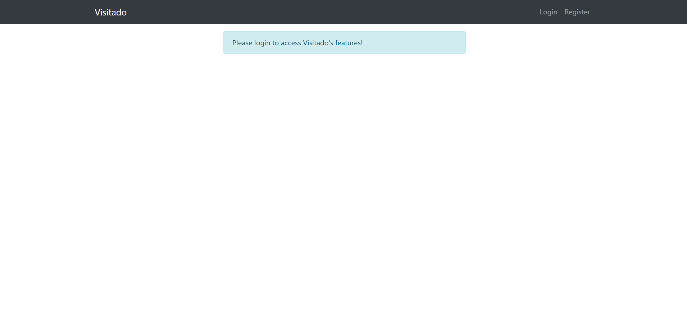
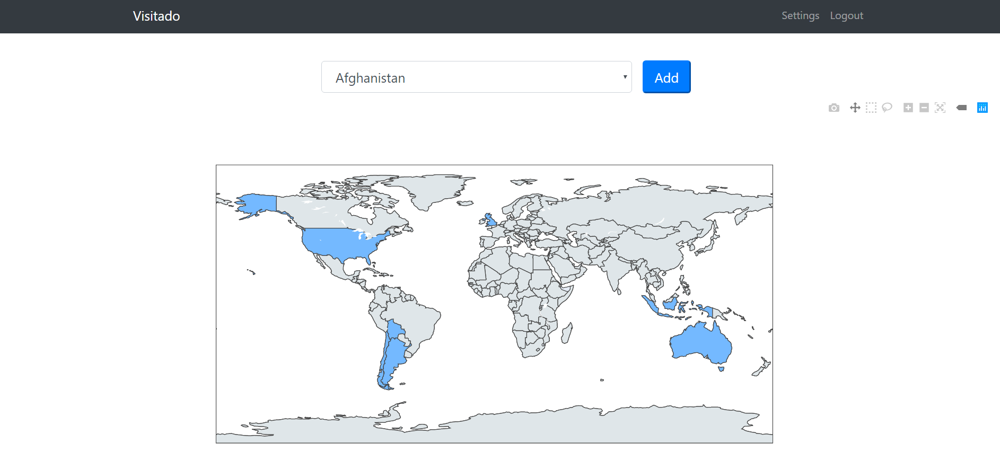

# Visitado
Visitado is a **web application built with Flask where users can keep track of the countries they have visited**.
The map is displayed using Plotly. 
The application also includes user authentication! 
Users can create an account, login, add any country to their map and delete them if necessary. They can also change the color of their visited countries in the settings.
Finally, users can click on one of their added countries to access a page for the given country with it's flag and a short description.

This was a very fun and challenging project that allowed me to practice my Python & Flask skills.
This is my first major Flask project created completely by my self.
It also required some serious problem-solving as I encountered many problems.
Finding solutions to these problems, bug-fixing and browsing google for hours looking for potential answers were what made this project so addicting.
I couldn't stop thinking about how I could get things to work and I kept looking forward to coming back to try solutions out.
Overall, I am very pleased with how the project has turned out and my friends have commented on how cool it is!

### What I've learned & Features:
* Creating a complete web application using Flask on my own
* Problem-solving and bug-fixing
* User authentication with Flask and WTForms: registration, login & logout
* Basic Database management using SQLAlchemy: creating users, adding/removing countries
* Displaying a map with Plotly, updating it with the relevant user information
* HTML and basic bootstrap
* Web Scraping with BeautifulSoup
* **Not giving up!** It sometimes took me hours of trial & error to achieve the result I wanted, but I got there eventually!

### Youtube Demo Video:
You can watch a live demonstration here: [Video](https://youtu.be/eXWhpvoy0IY)

### Some screenshots:

&nbsp;

&nbsp;

&nbsp;

&nbsp;

&nbsp;

&nbsp;

