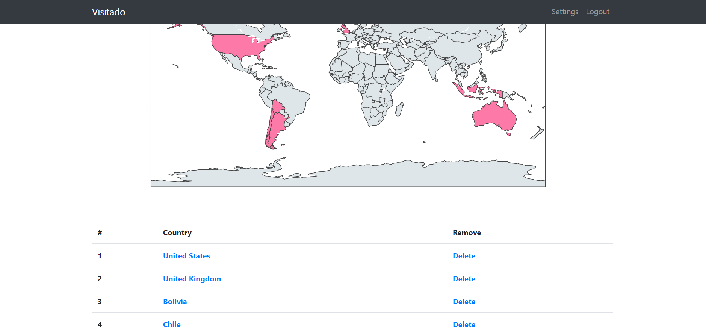

# Visitado
Visitado is a **web application built with Flask where users can keep track of the countries they have visited**.
The map is displayed using Plotly. 
The application also includes user authentication! 
Users can create an account, login, add any country to their map and delete them if necessary.

This was a very fun and challenging project that allowed me to practice my python & Flask skills.
This is my first major Flask project created completely independently.
It also required some serious problem-solving as I encountered many problems.
Finding solutions to these problems, bug-fixing and browsing google for hours looking for potential answers were what made this project so addicting.
Seriously, I couldn't stop thinking about how I could get things to work and I kept looking forward to coming back to try solutions out!

### What I've learned & Features:
* Creating a complete web application using Flask on my own
* Bug-fixing and problem-solving
* User authentication with Flask and WTForms: registration, login & logout
* Basic Database management using SQLAlchemy: creating users, adding/removing countries
* Displaying a map with Plotly, updating it with the relevant user information
* HTML and basic bootstrap
* **Not giving up!** It sometimes took me hours of trial & error to achieve the result I wanted, but I got there eventually!

&nbsp;
### Some screenshots:

&nbsp;

&nbsp;

&nbsp;

&nbsp;

&nbsp;

